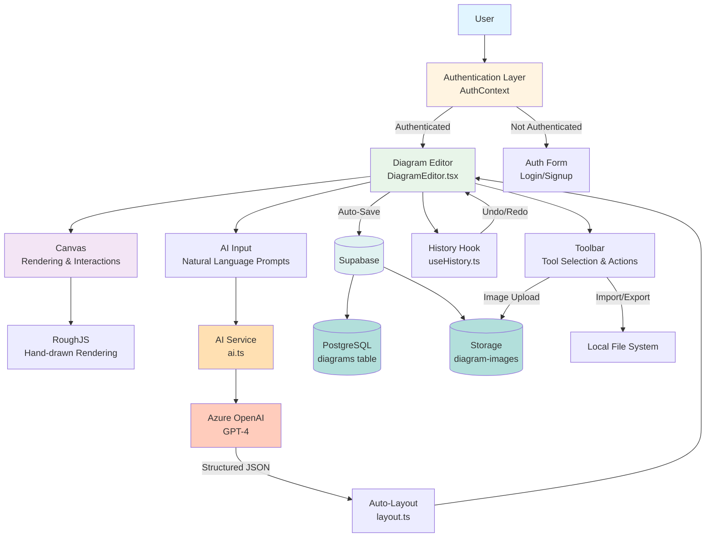

# AI-Diagrammer

An AI-powered diagram creation tool that transforms natural language descriptions into beautiful, hand-drawn style diagrams. Built with React, TypeScript, and Azure OpenAI.

## Features

- **AI-Powered Generation**: Convert natural language prompts into structured diagrams
- **Manual Drawing Tools**: Create and edit diagrams with rectangle, ellipse, diamond, and freehand pen tools
- **Image Support**: Upload and integrate images directly into your diagrams
- **Auto-Layout**: Intelligent hierarchical layout algorithm for organized diagrams
- **Undo/Redo**: Full history management with 50-state buffer
- **Auto-Save**: Automatic saving with 2-second debounce
- **Import/Export**: Save and load diagrams as JSON files
- **Authentication**: Secure user authentication via Supabase
- **Persistent Storage**: Cloud-based diagram storage with PostgreSQL
- **Hand-Drawn Aesthetic**: Beautiful sketchy style using RoughJS

## System Architecture



## Tech Stack

- **Frontend Framework**: React 18 with TypeScript
- **Build Tool**: Vite
- **Styling**: Tailwind CSS
- **Rendering**: RoughJS (hand-drawn aesthetic)
- **Backend**: Supabase (PostgreSQL + Storage)
- **Authentication**: Supabase Auth
- **AI Integration**: Azure OpenAI
- **Icons**: Lucide React

## Prerequisites

Before you begin, ensure you have the following installed:
- Node.js (v18 or higher)
- npm or yarn
- A Supabase account
- An Azure OpenAI account with API access

## Setup Instructions

### 1. Clone the Repository

```bash
git clone https://github.com/yourusername/AI-Diagrammer.git
cd AI-Diagrammer
```

### 2. Install Dependencies

```bash
npm install
```

### 3. Set Up Supabase

1. Create a new project at [supabase.com](https://supabase.com)
2. Go to **Project Settings** > **API** and copy:
   - Project URL
   - Anon/Public Key
3. Run the database migrations:
   - Go to **SQL Editor** in your Supabase dashboard
   - Copy and execute the SQL from `supabase/migrations/20251017192222_create_diagrams_schema.sql`
   - Copy and execute the SQL from `supabase/migrations/20251017212952_create_diagram_images_storage.sql`

### 4. Set Up Azure OpenAI

1. Create an Azure OpenAI resource in the [Azure Portal](https://portal.azure.com)
2. Deploy a GPT-4 or GPT-3.5 model
3. Get your API key and endpoint from **Keys and Endpoint** section

### 5. Configure Environment Variables

Create a `.env` file in the root directory:

```env
VITE_SUPABASE_URL=your_supabase_project_url
VITE_SUPABASE_ANON_KEY=your_supabase_anon_key
VITE_AZURE_OPENAI_API_KEY=your_azure_openai_api_key
VITE_AZURE_OPENAI_ENDPOINT=your_azure_openai_endpoint
```

**Example:**
```env
VITE_SUPABASE_URL=https://abcdefghijk.supabase.co
VITE_SUPABASE_ANON_KEY=eyJhbGciOiJIUzI1NiIsInR5cCI6IkpXVCJ9...
VITE_AZURE_OPENAI_API_KEY=abc123def456ghi789...
VITE_AZURE_OPENAI_ENDPOINT=https://your-resource.openai.azure.com/openai/deployments/your-deployment/chat/completions?api-version=2024-02-15-preview
```

### 6. Start the Development Server

```bash
npm run dev
```

The application will be available at `http://localhost:5173`

## Usage

### Manual Diagram Creation

1. **Sign Up/Login**: Create an account or log in with existing credentials
2. **Select a Tool**: Choose from rectangle, ellipse, diamond, text, or pen tools
3. **Draw**: Click and drag on the canvas to create shapes
4. **Edit**: Double-click nodes to edit text, drag to reposition
5. **Connect**: Select nodes and create edges between them
6. **Save**: Changes auto-save every 2 seconds, or press `Ctrl/Cmd + S` for manual save

### AI-Powered Generation

1. Click the **AI Input** button at the bottom of the screen
2. Enter a natural language description, for example:
   - "Create a user login flow with authentication and error handling"
   - "Design an e-commerce checkout process"
   - "Build a CI/CD pipeline diagram"
3. Click **Generate** and watch as the AI creates your diagram
4. Edit and refine the generated diagram as needed

### Keyboard Shortcuts

- `Ctrl/Cmd + S`: Manual save
- `Ctrl/Cmd + Z`: Undo
- `Ctrl/Cmd + Shift + Z`: Redo

### Import/Export

- **Export**: Click the export icon to download your diagram as JSON
- **Import**: Click the import icon to load a previously saved diagram
- **Images**: Click the image icon to upload and insert images

## Development

### Available Scripts

```bash
# Start development server
npm run dev

# Build for production
npm run build

# Preview production build
npm run preview

# Run linter
npm run lint

# Type check
npm run typecheck
```

### Project Structure

```
AI-Diagrammer/
├── src/
│   ├── components/        # React components
│   │   ├── AIInput.tsx
│   │   ├── AuthForm.tsx
│   │   ├── Canvas.tsx
│   │   ├── DiagramEditor.tsx
│   │   └── Toolbar.tsx
│   ├── contexts/          # React contexts
│   │   └── AuthContext.tsx
│   ├── hooks/             # Custom React hooks
│   │   └── useHistory.ts
│   ├── lib/               # Utility libraries
│   │   ├── ai.ts          # Azure OpenAI integration
│   │   ├── layout.ts      # Auto-layout algorithm
│   │   ├── supabase.ts    # Supabase client
│   │   ├── drawing.ts     # Drawing utilities
│   │   └── boundaries.ts  # Collision detection
│   ├── types/             # TypeScript type definitions
│   │   └── diagram.ts
│   ├── App.tsx            # Main app component
│   └── main.tsx           # Entry point
├── supabase/
│   └── migrations/        # Database migrations
├── public/                # Static assets
└── ...config files
```

## Database Schema

### Diagrams Table

| Column        | Type      | Description                    |
|---------------|-----------|--------------------------------|
| id            | uuid      | Primary key                    |
| user_id       | uuid      | Foreign key to auth.users      |
| title         | text      | Diagram title                  |
| description   | text      | Optional description           |
| diagram_data  | jsonb     | Nodes, edges, and paths        |
| created_at    | timestamp | Creation timestamp             |
| updated_at    | timestamp | Last update timestamp          |

### Storage Buckets

- **diagram-images**: Public bucket for uploaded images
  - Path structure: `{user_id}/{timestamp}.{ext}`

## Contributing

Contributions are welcome! Please feel free to submit a Pull Request.

## License

This project is open source and available under the MIT License.

## Support

For issues, questions, or contributions, please open an issue on GitHub.

## Acknowledgments

- [RoughJS](https://roughjs.com/) for the hand-drawn aesthetic
- [Supabase](https://supabase.com/) for backend infrastructure
- [Azure OpenAI](https://azure.microsoft.com/en-us/products/ai-services/openai-service) for AI capabilities
- [Lucide](https://lucide.dev/) for beautiful icons
